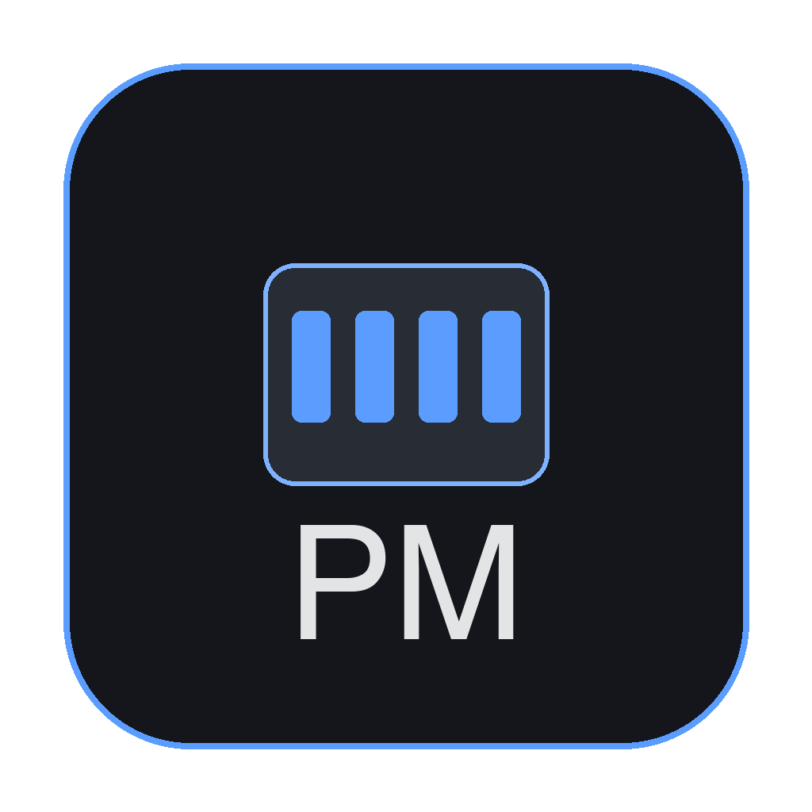

# Port Map

> 로컬 포트 점유 현황을 실시간으로 보여주는 데스크톱 위젯



바탕화면에 항상 떠 있는 반투명 미니 패널로, 어떤 포트를 어떤 프로세스가 쓰고 있는지 한눈에 볼 수 있습니다. 포트 충돌이 잦은 개발자를 위해 만들었습니다.

## 기능

- **실시간 포트:프로세스 표시** — 3초 폴링, 카드 그리드
- **친화적 프로세스명** — `bun.exe`가 아니라 `opencodex`로 표시 (cmdline에서 패키지명 추출)
- **검색** — 포트번호 / 프로세스명 즉시 필터
- **항상 위** — 다른 창 위에 떠 있음 (토글 가능)
- **프레임리스 반투명** — 위젯 느낌, 드래그로 위치 이동
- **클릭 확장** — 한 번 클릭하면 PID, 명령어, 원격 연결 + **연결 해제** 버튼
- **포트 연결 해제** — 클릭 한 번으로 프로세스 종료 (SIGTERM)
- **위치 기억** — 재실행 시 마지막 위치/크기 복원
- **크로스플랫폼** — macOS, Windows, Linux

## 빠른 시작

### 1. 설치 + 빌드 (원클릭)

```bash
git clone https://github.com/Min0504/port-map.git
cd port-map
./install.sh
```

또는 수동:

```bash
# 가상환경 + 의존성
uv venv --python 3.13 .venv          # 또는: python3 -m venv .venv
uv pip install --python .venv/bin/python -r requirements.txt

# 빌드 (아이콘 포함)
./build.sh
```

### 2. 실행

```bash
# 개발 모드
.venv/bin/python app.py

# 빌드된 바이너리
./dist/port-map

# macOS 앱 번들
open dist/port-map.app
```

## 터미널 단축키 (선택)

`~/.zshrc` 또는 `~/.bashrc`에 추가:

```bash
alias pm="cd /path/to/port-map && .venv/bin/python app.py"
```

이제 어디서든 `pm` 입력으로 바로 실행.

## 옵션

```bash
.venv/bin/python app.py --interval 5 --opacity 0.8 --click-through
```

| 옵션 | 기본값 | 설명 |
|------|--------|------|
| `--interval` | 3 | 폴링 주기 (1~30초) |
| `--opacity` | 0.85 | 창 투명도 (0.6~0.95) |
| `--scanner` | auto | psutil / lsof / netstat |
| `--port` | 0 | HTTP 바인딩 포트 (0=자동) |
| `--no-on-top` | false | 항상 위 해제 |
| `--click-through` | false | 위젯 클릭통과 모드 |

환경변수: `PORT_MAP_INTERVAL` (폴링 주기)

## 사용 방법

1. 위젯이 화면에 뜹니다 — 포트 목록이 카드로 표시됩니다
2. **검색창**에 포트번호나 프로세스명 입력 → 즉시 필터
3. 카드 **한 번 클릭** → 상세 정보 + **연결 해제** 버튼
4. **연결 해제** 클릭 → 확인 후 프로세스 종료 (SIGTERM)
5. 상단 **드래그 핸들** 잡고 끌기 → 위치 이동 (재실행 시 복원)

## 설정 파일

`~/.config/port-map/config.json`에 창 위치/크기/설정이 저장됩니다.

## 기술 스택

- **pywebview** — 네이티브 창 (frameless, always-on-top, 드래그)
- **psutil** — 크로스플랫폼 포트 스캔 (권장)
- **netstat / lsof** — 폴백 스캐너
- **Python stdlib http.server** — 백엔드 (의존성 0)
- **Vanilla HTML/CSS/JS** — 프론트엔드 (프레임워크 없음)

## 아키텍처

```
┌──────────────┐     HTTP 127.0.0.1     ┌──────────────┐
│  index.html  │ ←── fetch /api/ports ─→ │   server.py  │
│  (pywebview) │     JSON 스냅샷         │ ThreadingHTTP│
└──────────────┘                        └──────┬───────┘
                                               │
                                        ┌──────▼───────┐
                                        │  scanners/   │
                                        │  psutil(권장)│
                                        │  netstat(폴백)│
                                        └──────────────┘
```

## 개발

```bash
# 테스트
.venv/bin/python tests/test_scanners.py

# 가상환경 새로 만들기
make setup

# 빌드
make build
```

자세한 내용은 [PLANNING.md](PLANNING.md)와 [CONTRIBUTING.md](CONTRIBUTING.md) 참조.

## 미서명 실행 안내

### macOS
Gatekeeper가 "확인되지 않은 개발자" 경고를 띄웁니다:
1. Finder에서 Port Map 우클릭 → "열기" → "열기" 확인
2. 또는 `xattr -cr /path/to/Port Map.app`

### Windows
SmartScreen 경고 → "추가 정보" → "실행" 클릭.

## 라이선스

MIT — [LICENSE](LICENSE)

## 기여

[CONTRIBUTING.md](CONTRIBUTING.md)를 참조하세요. 이슈/PR 환영합니다.
